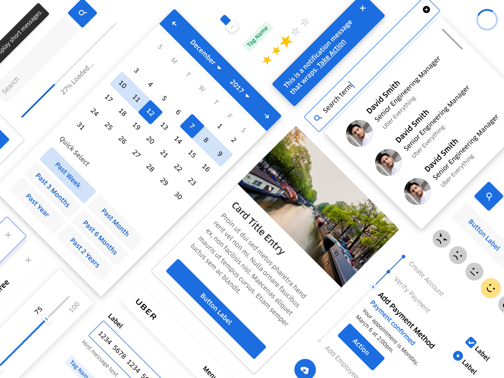

[Base Web](https://baseweb.design)은 Uber의 디자인 시스템 Base의 React 구현체다. 기본 컴포넌트를 충실하게 제공하고, 복잡한 컴포넌트로는 Payment Card, Daypicker 등을 제공한다. 테마를 지원하는데 색상 종류는 단순하고 Typography는 세세하다. TypeScript와 Flow를 모두 지원하며 브라우저는 IE11까지 지원한다. 처음에는 깔끔하고 단순한 스타일이 마음에 들었는데, 결정적으로는 맞춤설정(customization)이 편리하다는 것이 제일 좋았다.

## 강력하고 편리한 맞춤 설정

Base Web은 [광범위한 재정의 인터페이스(extensive overrides interface)를 통한 맞춤설정](https://baseweb.design/getting-started/comparison/)을 지원한다. 반면 다른 컴포넌트 라이브러리는 CSS나 Less 재정의 (overrides)를 제공한다. CSS-in-JS의 시대에 맞춤설정을 위해 CSS, Less 또는 그 생성기를 관리하는 것은 불편하다. 개인적으로 이런 불편함이 Semantic UI와 같은 기존 프레임워크를 사용하지 않는 가장 큰 이유다.

Base Web의 맞춤설정을 사용하는 방법을 단계별로 정리해보았다.

### 1. Theme 변경

- `primary400`과 같은 [theme primitives 값](https://github.com/uber-web/baseui/blob/master/src/themes/light-theme-primitives.js)을 변경하여 기본 색상과 기본 폰트만 바꾼다.
- `buttonPrimaryFill`과 같은 [theme creator의 overrides 값](https://github.com/uber-web/baseui/blob/master/src/themes/creator.js)을 변경하여 각종 컴포넌트에서 색상이 사용되는 방식과, border, typography 등을 수정한다.

### 2. Component의 overrides prop 사용 (재정의 인터페이스)

```jsx
<StatefulList
  overrides={{
    Label: {
      style: ({ $theme }) => ({
        color: $theme.colors.negative600,
      }),
    },
  }}
/>
```

- 위의 예제는 StatefulList 컴포넌트의 Label 색상을 overrides prop으로 변경한다. 이처럼 컴포넌트의 각 부분을 변경할 수 있다. 공식 문서에서 [Overrides Inspector](https://baseweb.design/theming/understanding-overrides/#overrides-inspector)를 통해 어떤 부분이 어떤 이름인지 시각적으로 보여준다.
- `$theme`를 사용해서 테마의 값을 사용할 수 있고, `$selected`처럼 상태를 나타내는 parameter를 사용할 수도 있다.
- style 외에 prop을 추가할 수도 있고, 아예 하위 컴포넌트를 직접 만든 컴포넌트로 교체할 수도 있다.

### 3. Block 컴포넌트 사용

```jsx
<Block
  display="flex"
  paddingTop="100px"
  height={['20px', '40px', '80px', '160px']}
  backgroundColor="primary200"
/>
```

- 기본 컴포넌트의 변형이 아닌 새 컴포넌트를 만들 때는 [Block](https://baseweb.design/components/block/)을 사용할 수 있다. Block은 style을 쉽게 설정할 수 있는 다양한 prop을 제공한다.
- 이러한 prop은 React의 style prop보다 유용하다. 화면 너비에 따라 height을 조절하고 싶을 때 배열을 사용하면, 테마의 breakpoint 값에 따라 알맞은 값이 선택된다. 또한 `primary200`처럼 테마에 정의된 값을 바로 사용할 수 있다.
- 이런 방식은 [Rebass](https://rebassjs.org/)와 유사한데 Rebass의 `m`, `px`와 같은 단축어가 없고 font 관련 prop이 없는 것이 아쉽다. 대신에 Base Web은 `grid`, `height`, `top` 등 더 많은 prop을 제공한다.

### 4. HTML element와 useStyletron() 사용

```jsx
function UseStyletronExample() {
  const [useCss, theme] = useStyletron()
  return (
    <div className={useCss({ color: theme.colors.primary })}>
      This is a blue div
    </div>
  )
}
```

- Block에서 prop으로 제공하지 않는 style을 변경하고 싶을 때는 [useStyltron()](https://baseweb.design/components/use-styletron/) hook을 사용하면 된다. style prop과 비슷해보이지만 inline style로 들어가는 대신에 Styletron의 CSS 생성 과정을 거쳐서 여러 class의 조합으로 생성된다.

처음 Base Web을 사용할 때는 어떤 경우에 어떤 방식을 사용해야할지 알 수가 없었다. 예를 들어 Button에 border를 추가하고 싶을 때, 테마에서 지원하는지 문서에서 찾을 수 없어서 [theme creator](https://github.com/uber-web/baseui/blob/master/src/themes/creator.js) 코드를 살펴봐야 했다. 또 [useStyltron()](https://baseweb.design/components/use-styletron/)을 몰라서 Block과 style prop만을 사용하기도 했다. 이런 부분의 가이드가 자세하지 않은 것은 아쉬웠다.

하지만 강력한 맞춤설정 기능을 제공한다는 것은 확실하다. 재정의 인터페이스는 [Overrides Inspector](https://baseweb.design/theming/understanding-overrides/#overrides-inspector)를 제공해서 어떤 부분을 변경할 수 있는지 보여주고, 하위 컴포넌트를 갈아치우는 것을 가능하게 한다. 또한 [Block](https://baseweb.design/components/block/)과 같은 헬퍼 컴포넌트를 통해 responsive style을 간단하게 정의할 수 있다.

## 겪었던 문제들

이 부분에서는 Base Web을 사용하면서 겪었던 문제들을 나열해보고자 한다.

- 위에서 얘기했듯이 테마로 변경 가능한지, 재정의 인터페이스를 사용해야하는지 코드를 찾아봐야 한다. 그래서 [theme creator](https://github.com/uber-web/baseui/blob/master/src/themes/creator.js) 코드를 항상 브라우저 탭에 띄워두고 중간중간 보았다.
- Styled Components의 GlobalStyle과 같은 것이 없어서 `index.css` 파일을 만들어서 넣어주었다.
- TypeScript 지원이 완벽하지 않아서 `// @ts-ignore`로 넘어간 부분이 있다. (예: DebugEngine)
- Datepicker에서 locale을 사용하려면 `date-fns`를 써야하는데, `date-fns`의 2.0 beta 버전을 사용해야 한다는 것이 문서에 없었다.
- CSS Object를 작성할 때 `border`와 같은 shorthand 대신에 `border-width`, `border-style`, `border-color`의 longhand로 나눠써야 한다. 그렇지 않으면 예기치 않은 결과가 나올 수 있다. 그 원인은 [Styletron 문서](https://www.styletron.org/concepts/#shorthand-and-longhand-properties) 참조.
- Button, Input에 border가 없는 것이 기본이라 border를 추가하는 것이 까다롭다.
- Styletron이 [“Virtual CSS Classes”](https://ryantsao.com/blog/virtual-css-with-styletron#atomic-css-and-virtual-classes)를 사용해서 필요없는 class를 줄이는 것은 좋은데, class가 너무 많이 생겨서 개발자 도구에서 CSS를 확인할 때 조금 불편하다.

## 결론

지난 글 [UI 프레임워크 고민](https://choyongjoon.com/ui-framework-question/)에서 밝혔듯이 여러 UI 프레임워크를 써보는 것이 좋다고 생각한다. 그런 의미에서 Base Web도 한번 사용해보았는데 생각보다 만족스러웠다. 깔끔한 테마의 주요 컴포넌트를 제공하고 TypeScript를 지원한다. UI 프레임워크의 단점인 맞춤설정이 어렵다는 점을 해결하는 강력하고 편리한 기능들을 제공한다. 익숙해지는 과정에서 몇몇 문제가 있었지만 해결 가능했다. 당분간은 UI 프레임워크 고민없이 Base Web를 기본으로 쓰려고 한다.
