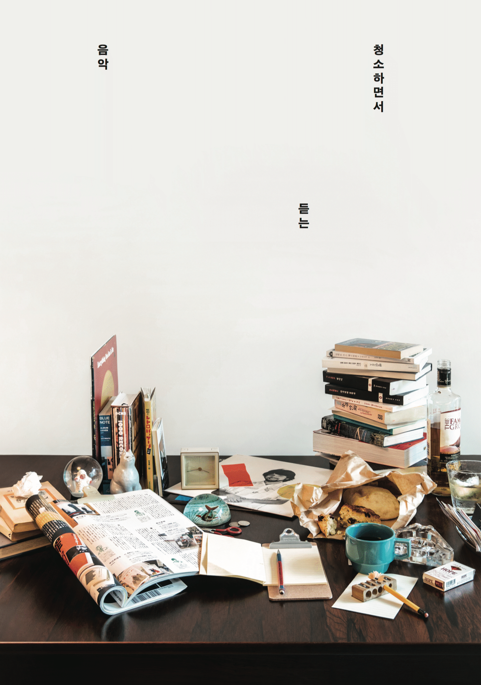

[청소하면서 듣는 음악 (이재민)](http://workroompress.kr/books/cleaning-music)

책을 펼쳐보면 왼쪽 페이지에는 커다란 음반 사진이 있고, 오른쪽 페이지에는 2단으로 된 글이 있다. 한 단의 너비는 내 아이폰7의 화면 너비 보다 조금 넓다. 글씨 크기를 조금 줄이고 1단 뒤에 2단이 오도록 배치하면 모바일에서 보기에 알맞게 금새 바뀔 것 같았다. 글 제목, 음반 이름, 아티스트 명 모두 같은 크기의 같은 폰트라는 단순함도 마음에 들었다. 이 디자인을 빠르게 웹 페이지로 만들어 보고 싶었다.

우선 폰트를 찾는 것부터 시작했다. 웹에서, 무료로, 쉽고 빠르게 쓸 수 있는 폰트는 한계가 있으므로 Google Fonts에 있는 것들 중에서 최대한 비슷한 것들을 한참 찾아보았다. 한글 폰트는 "나눔 명조", 숫자와 영문은 "Crimson Text", 왼쪽 페이지에 있는 san-serif 폰트는 "고딕 A1"으로 골랐다. 책을 화면에 대고 line-height 값을 설정했다. 글씨 크기는 일반적인 본문 글씨 크기보다 큰 18px로 설정해서 (모바일 트위터의 경우 15px) 책과 한 줄에 들어가는 글자 수를 얼추 맞추었다.

그 결과가 바로 이 블로그이다. 책의 시원시원한 여백이 없고 폰트의 느낌도 좀 다르지만, 제법 만족스럽다. 이렇게 글을 써서 올리고 여러 화면에서 다시 확인하면서 계속 고쳐나가려고 한다.
