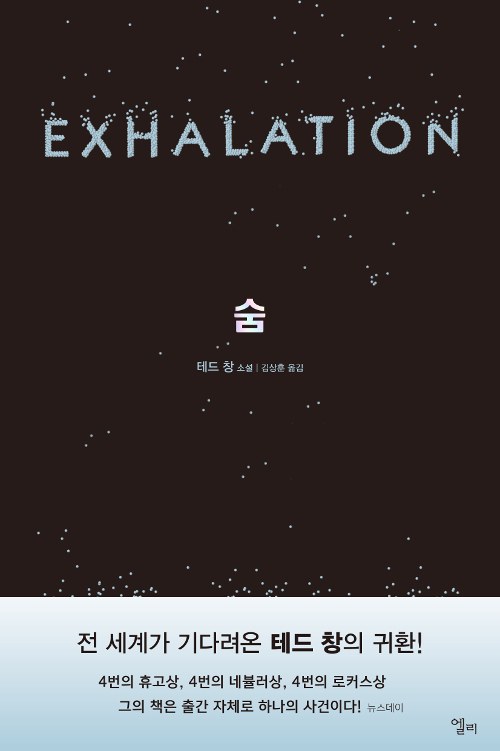

[테드 창 <숨>](https://books.google.co.kr/books?id=ac6fDwAAQBAJ&printsec=frontcover&dq=isbn:9791164050338&hl=ko&sa=X&ved=0ahUKEwja77mK_6HjAhVBHKYKHfWeDGsQ6AEIKDAA#v=onepage&q&f=false)

SF 소설을 읽을 때 어떤 반전을 기대하거나 어떤 비극이 일어나지 않을까 의심하면서 읽고는 했다. <숨>의 첫 두 단편 소설을 읽을 때도 그랬다. '상인과 연금술사의 문'에 나오는 20년 전 혹은 20년 뒤로 갈 수 있는 문에는 어떤 저주나 악마의 계략이 숨어있어서 그 문을 사용한 인물들이 파멸을 맟지 않을까 의심했다. 표제작 '숨'에서는 이 세계가 지구가 아닐까, 인류의 미래가 아닐까 등등의 의심을 했다. 하지만 두 소설을 다 읽고 나서는 내 의심의 하찮아졌고 그렇게 읽은 내가 부끄러워졌다. 이렇게 아름다운 소설에 제대로 집중하지 못하다니.

'숨'은 앤트로피에 대한 우아한 비유였다. 열역학 제1법칙에 따라 우리의 세계는 언젠가 열적평형상태에 도달할 것이다. 모든 별들이 꺼지고 우주의 모든 부분의 온도가 같아져서 더이상 아무런 일도 일어나지 않는 우주의 종말. 하지만 열의 흐름과 천문학적인 시간을 상상하는 것은 어렵다. '숨'의 세계에서는 열이 공기의 흐름으로 대체된다. 주인공을 비롯한 기계들은 매일 압축된 공기를 채운 허파를 교체하고, 그 허파에서 나오는 공기를 사용해 움직인다. 심지어 우리의 뇌와 같이 사고를 하는 기관도 공기의 흐름으로 움직인다. 이 뇌의 동작 원리를 관찰하는 부분의 묘사는 경이로웠다. 마치 애플의 제품 제작 영상에서 매끈한 알루미늄을 볼 때, 기계식 시계의 작은 톱니들의 동작을 설명하는 영상을 볼 때와 비슷하지만 상상력을 활용할 수 있어 더 생생한 느낌을 받았다. 엔트로피와 열의 흐름은 볼 수 없고, 뇌의 시냅스 사이의 물리 화학적 기작도 복잡한데, 이들은 공기의 흐름으로 표현하면서 더 시각적이고 감각적으로 상상할 수 있었다.

'소프트웨어 객체의 생애 주기'의 소재는 디지털 세계의 인공지능 애완동물[1] "디지언트"와 그 주인이다. 이들은 인공지능이지만 엄청난 능력을 가지고 있지 않다. 아기 동물처럼 훈련이 필요하고 실용적인 일을 할 수 없다. 그러나 동물과는 다르게 인간과 대화할 수 있고 어린이와 청소년 정도의 자아를 가진다. 하지만 소프트웨어라서 가상 공간 속에 존재하고 복제될 수 있으며 중지될 수도 있다. 이러한 디지언트의 설정은 교묘하게 애매해서 현실의 어떤 것과도 일치하지 않고, 아이, 반려동물, 게임 캐릭터 등등 여러 방면으로 연결지을 수 있다.

이 디지언트를 만들던 회사와 디지언트가 있던 가상공간이 망하면서 디지언트 주인들의 고민이 깊어진다. 예를 들자면 싸이월드에서 디지언트를 키웠는데 페이스북이 대세가 된 상황이다. 이 디지언트를 페이스북으로 옮겨서 계속 같이 지내며 다른 디지언트, 사람과 만나게 해주고 싶지만 호환되지 않는다. 페이스북으로 이식하기 위해서는 큰 돈을 들여 프로그래머들을 고용해야 한다. 우리 세계에서도 애착을 가지는 옛날 제품이나 프로그램이 새로운 환경에 호환되지 않아 안타까운 상황들이 있지만, 디지언트들은 자아가 있고 그 주인과 더 친밀하게 소통한다는 점이 큰 차이다.

이런 상황이 치밀하게 현실적이고 그 안에서 끈질기게 고민하고 노력하는 인물들이 있다. 새로운 플랫폼이 등장하며 호환이 안된다는 큰 줄기부터가 현실적이다. 여기서 설명하기는 어렵지만 다른 종류의 디지언트가 등장하기도 하고, 디지언트에 무책임한 주인, 디지언트를 괴롭히려는 사람들 등 작은 에피소드들이 치밀함을 완성시킨다. 소수의 다지언트 주인들은 이식을 위한 기금을 마련하기 위해 노력하지만, 결국 가능한 방법은 회사에 디지언트를 연구용으로 넘기고 그 보상으로 이식 프로젝트를 진행하는 것이다. 이 글에서는 이렇게 짧게 요약되지만 소설에서는 여러 인물들의 고뇌가 있다. 유저 그룹 게시판을 통해 논의하고, 디지언트와 얘기해보기도 하고, 선택으로 인해 벌어질 일들을 디지언트와 내가 감당할 수 있는지 고민한다. 나는 이렇게 치열하게 고민할 수 있을까 생각이 들도록. 마지막을 읽고 나면 결국 이렇게 될 수 밖에 없었을까, 앞으로도 계속 고난이 있을텐데와 같은 긴 고민의 여운이 남는다.

처음에 매력적으로 다가오는 것은 SF 세계의 세계관이지만 결국 인상적으로 남는 것은 그 안의 인물들이었다. 현실의 여러 면을 가지고 있지만 현실과는 다른 세계를 통해 우리 세계의 다양한 면으로 연결된다. 한 소설을 읽은 뒤 여러 맥락에서 생각해보는 것이 큰 즐거움이었다. 앞에서 '숨'을 엔트로피에 대한 비유라고 했지만, 몰락한 고대 문명이나 인간의 노화로도 생각해 볼 수 있었다. 그리고 이야기를 되돌아보면 여러 인물들에서 숭고함을 느끼고 존경하게 되었다. 소개하지 않은 소설의 인물들에게도 결론에 도달하기 까지 탐구하고 고민하는 모습이 드러난다. 인물들의 처했던 상황과 그 때의 용기있는 결정, 그 이후의 꾸준한 노력을 생각하며 나도 이런 태도로 살아가야겠다고 다짐하게 되었다.

--

[1] 반려동물이 더 좋은 표현이지만 책에서 사용한 애완동물을 그대로 사용하였다.
