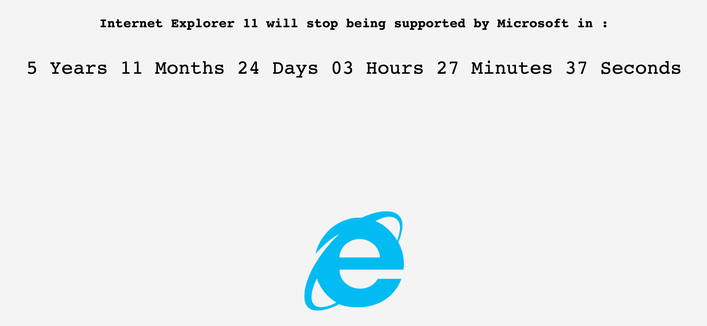

[IE11 end of support countdown](https://death-to-ie11.netlify.com/)

IE11 지원하다 보니 이런저런 문제가 많이 생겼다. 어떻게 접근했는지와 어떤 문제가 있었는지 공유하고자 한다.

## JS

TypeScript를 사용할 때 Babel을 꼭 써야 하는 것은 아니지만 [@babel/preset-env](https://babeljs.io/docs/en/babel-preset-env)가 브라우저 호환성 맞추는데 강력한 도구이기 때문에 꼭 쓰는 것을 추천한다. 지원할 브라우저를 이름이나 점유율로 명시하면 그에 맞는 transform과 polyfill이 자동으로 설정된다.

### Prettier의 trailing comma와 `index.html` 문제

Git의 diff를 좀 더 깔끔하게 하기 위해서 Prettier의 `trailingComma` 옵션을 `"all"`로 사용하고 있었다. 일반적인 코드는 Babel을 거쳐서 나가기 때문에 문제가 안 된다. 하지만 `index.html`에 [Facebook Pixel](https://developers.facebook.com/docs/facebook-pixel) 코드가 들어있었는데, Prettier가 함수 arguments의 마지막에 예쁘게 “,”를 붙여주었다. 이 “,”를 IE11은 이해하지 못해서 Error가 발생했다. `.prettierignore`에 `index.html`를 추가하는 방식으로 문제를 해결했다. 또는 이 코드를 다른 곳으로 옮겨서 Babel을 거치도록 할 수도 있을 것이다.

### Array의 flat(), flatMap()

Babel이 모든 polyfill을 해결해주는 것은 아니다. [core-js](https://github.com/zloirock/core-js)는 버전 3부터 flat, flatMap을 지원하기 시작했다. 이 문제 때문에 버전 2에서 버전 3으로 올렸다.

### URLSearchParams

Babel이 모든 polyfill을 해결해주는 것은 아니다. 이런 지원하지 않는 Class도 신경 써줘야 한다. `url-search-params-polyfill`을 설치하여 해결했다.

### MobX 4

[MobX의 브라우저 지원](https://github.com/mobxjs/mobx#browser-support) 문서에 따라 반드시 4.x 버전을 사용해야 한다. 5.x 이후부터는 ES6 Proxy를 사용하는데 이것은 polyfill이 불가능하기 때문이다. 이 때문에 MobX를 사용하는 내부 라이브러리도 두 가지 버전을 유지하고 있다.

## Style

CSS reset은 [sanitize.css](https://github.com/csstools/sanitize.css)를 사용했다. CSS-in-JS를 사용한다면 기본적인 vendor prefix는 알아서 붙여준다. 그렇지 않다면 webpack에 postcss 설정이 필요하다. UI 라이브러리를 사용할 때는 브라우저 지원 범위를 직접 확인해봐야 한다. 블로그에서 소개하기도 했던 [Base Web](https://choyongjoon.com/base-web/)은 IE11까지 지원한다고 했지만 몇몇 컴포넌트에서는 문제가 있어서 직접 수정해야 했다.

### Flexbox

기본적으로 IE11은 flexbox를 잘 지원하지만 몇몇 버그나 다른 동작이 있다. 예를 들어 Base Web의 Modal은 minHeight 속성을 사용하는데, 이 경우 수직 중앙 정렬이 제대로 되지 않는다. 따라서 height 속성을 추가해줘야 했다. Flexbox 작업을 시작하기 전에 아랫글을 읽어보면 좋다.
[Normalizing Cross-browser Flexbox Bugs — Philip Walton](https://philipwalton.com/articles/normalizing-cross-browser-flexbox-bugs/)

### Scrollbar

브라우저의 스크롤바가 숨겨지는 맥에서만 개발하다 보면 스크롤바가 항상 표시되는 윈도 브라우저들을 신경쓰지 못할 때가 있다. 따라서 스크롤이 있는 부분은 항상 윈도에서 스크롤바가 어떻게 생기는지, 스크롤바의 너비에 따라 레이아웃이 깨지지 않는지 확인해야 한다.

### Modal and Scrollbar

일반적으로 UI 라이브러리에서 Modal이 열렸을 때 body에 `position: absolute;` 속성을 추가하여 Modal 뒤가 스크롤이 되는 것을 막는다. 이때 윈도우 브라우저에서는 우측의 스크롤바가 사라지면서 화면의 모든 요소가 우측으로 약간씩 이동하는 증상이 생겨서 보기에 안 좋다. Base Web의 Modal에서 발생한 문제였는데 다른 라이브러리들은 어떤지 찾아보았다. [Bootstrap](https://getbootstrap.com/)은 별도 코드를 써서 모달이 열릴 때 사라진 스크롤바의 너비만큼 padding을 추가하는 방식을 사용했다. [Atlaskit](https://atlaskit.atlassian.com/)은 [react-scrollLock](https://jossmac.github.io/react-scrolllock/)이라는 라이브러리를 사용해서 같은 효과를 얻었다. 그래서 react-scrollock을 사용하는 것으로 해결했다. 좋은 UI 라이브러리를 평가하는 기준으로 이 문제를 해결했는지 살펴보는 것도 좋을 것 같다.

### Placeholder

input을 클릭하고 아무것도 입력하지 않았을 때, 다른 브라우저에서는 placeholder가 보이지만, IE에서는 보이지 않는다. placeholder에 스타일 적용할 때도 `:-ms-input-placeholder`를 사용해야 한다. 가장 희한한 버그는 placeholder의 오른쪽 끝을 클릭하면 커서가 placeholder 뒤에 삽입되고 키보드로 입력이 되는 버그였다. 따라서 아예 디자인 단계에서부터 placeholder를 최대한 사용하지 않는 것이 좋다. [placeholder를 사용하지 않을 이유는 충분하다.](https://www.smashingmagazine.com/2018/06/placeholder-attribute/)

### SVG

네이버 지도에 Marker를 svg 이미지로 추가했더니 보이지 않았다. 다른 브라우저에서는 네이버 지도가 svg의 height과 width를 잘 읽어서 그려주는데 IE에서는 읽어오지 못하는 버그가 있었다. Retina 대응을 위해서 지도 Marker의 이미지는 png보다 svg를 선호했는데 IE 때문에 2배 크기의 png로 교체했다.

## Performance

IE는 테스트해보면 확실히 느리다. 이런 성능 저하가 치명적인 문제가 된 적은 없었지만, 쉬운 해결책도 찾지 못했다. 로딩과 렌더링을 최적화에 더 신경을 쓸 수밖에. IE에서 버벅댐 없이 돌아간다면 다른 브라우저에서는 매우 잘 돌아갈 것이다.

## 결론

Babel과 polyfill을 덕분에 최신 TypesScript(또는 ECMAScript)를 사용하면서도 IE를 지원하는 것이 가능해졌다. 하지만 좋은 도구들과 함께해도 IE 지원은 험난했다. 사용할 라이브러리의 지원범위를 문서로, 직접 확인하여 선택하고 보완해야 한다. IE에서 주의해야 할 부분과 남들은 어떻게 해결하는지 알아보고 정리하는 것도 중요하다.
