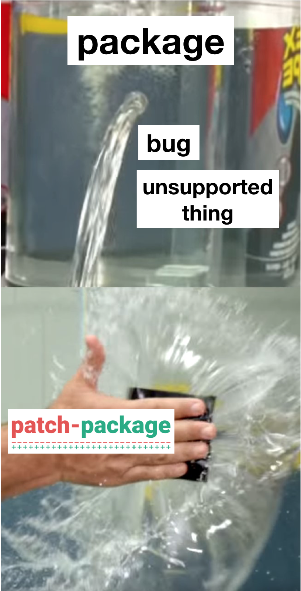

여러 package를 사용하다보면 크고 작은 문제가 생긴다. 이 중에서 어떤 문제는 `node_modules` 안의 해당 package 코드를 조금만 수정하면 금방 해결될 것처럼 보인다. 하지만 그 코드를 수정하는 것은 안전하지 않다. 로컬 환경에서는 해결되지만 다른 개발자나 CI 환경에서는 `node_modules` 안의 수정사항이 적용되지 않기 때문이다. 이럴 때 [patch-package](https://github.com/ds300/patch-package)를 사용하면 안전하게 수정사항을 공유할 수 있다.

patch-package는 `node_modules` 안의 수정사항이 Git으로 관리되고, 어떤 환경에서도 적용되도록 보장한다. 구체적으로는 다음의 두 역할을 한다.

1. `node_modules` 안의 특정 package의 수정사항을 patch 파일 형태로 `patches` 아래에 저장한다.
2. `patches` 안의 patch를 `node_modules` 안에 적용한다.

yarn을 기준으로 설치와 사용법은 다음과 같다.

#### patch-package와 postinstall-postinstall를 함께 dev로 설치한다.

```sh
yarn add -D patch-package postinstall-postinstall
```

#### `package.json`의 "scripts"에 다음과 같이 추가한다.

```diff
 "scripts": {
+  "postinstall": "patch-package"
 }
```

#### package 코드를 수정한 뒤에 아래 명령으로 patch를 만든다.

```shell
yarn patch-package package-name
```

#### 생성된 patch를 commit한다.

```shell
git add patches/some-package+3.14.15.patch
git commit -m "fix brokenFile.js in some-package"
```

--

patch-package를 통해 시간을 많이 절약했기 때문에 추천하고 싶었다. 이것을 알기 전에 한 package의 TypeScript type 정의를 수정하려고 했던 적이 있었다. package 안의 코드를 수정하면 간단했지만, 외부에서 해결할 수 있는 방법을 연구하다보니 거의 하루를 날렸다. 결국 검색을 통해서 알게된 patch-package로는 몇 분 안에 해결했다. 이후에 다른 package의 간단한 버그를 찾았을 때는 바로 patch-package로 버그를 수정해서 빠르게 QA 환경에 배포할 수 있었다. 물론 이후에 해당 package 저장소에 PR을 보냈다.

package에서 문제가 있을 때 해결방법은 여러가지가 가능하지만 수정 범위가 작고 시간이 부족하다면 patch-package가 훌륭한 답이 될 것이다. 위의 예시처럼 package 외부의 프로젝트 코드에서 해결방법을 찾을 수도 있고, issue와 PR을 올려서 수정을 요청할 수도 있고, 다른 package로 교체하거나 직접 구현해야할 수도 있다. 어떤 선택이 좋은지는 상황에 따라 다르다. 빠르고 안전한 방법을 하나 알고 있다면 좋은 선택을 하는데 큰 도움이 될 것이다.
